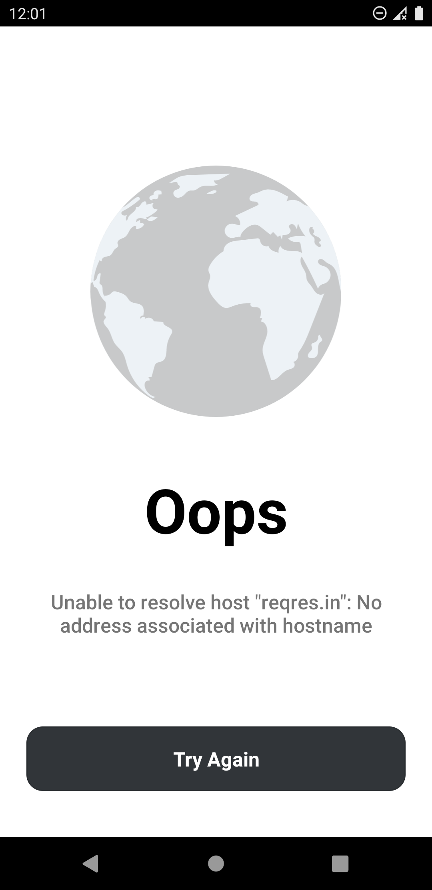

# NetworkRetry-RetrofitAdapter
- A retry mechanism with the call it self without bothering the ui to choose what to retry and without complex loigc!.
- the response won't even come back if you didn't hit retry button so it's the Actual call that you requested is what is being used.

## Including in your project
[](https://jitpack.io/#EsmaeelNabil/NetworkRetry-RetrofitAdapter)
### Gradle 
Add below codes to your **root** `build.gradle` file (not your module build.gradle file).
```gradle
allprojects {
    repositories {
    	....
	maven { url 'https://jitpack.io' }
    }
}
```
And add a dependency code to your **APP**'s `build.gradle` file. [](https://jitpack.io/#EsmaeelNabil/NetworkRetry-RetrofitAdapter)
```gradle
dependencies {
	  implementation 'com.github.EsmaeelNabil:NetworkRetry-RetrofitAdapter:0.5'
}
```
## Usage :

#### add those in your retrofit implementation.
``` kotlin

fun getNetworkRetryCallAdapter(): NetworkRetryCallAdapterFactory {
        return NetworkRetryCallAdapterFactory.create { call, exception, retryCall ->

            dialogManager.showNetworkScreen(
                message = exception.message ?: "",
                onRetry = { retryCall() }
            )

        }
    }

Retrofit.Builder()
            ...
            .addCallAdapterFactory(getNetworkRetryCallAdapter())
            .build()

```

#### [dialogManager.showNetworkScreen](https://github.com/EsmaeelNabil/NetworkRetry-RetrofitAdapter/blob/master/app/src/main/java/com/esmaeel/networkretry/utils/DialogManager.kt#L31) screen design.



